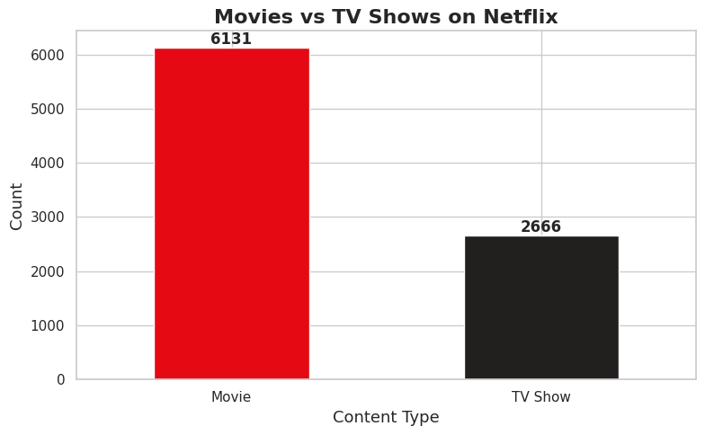
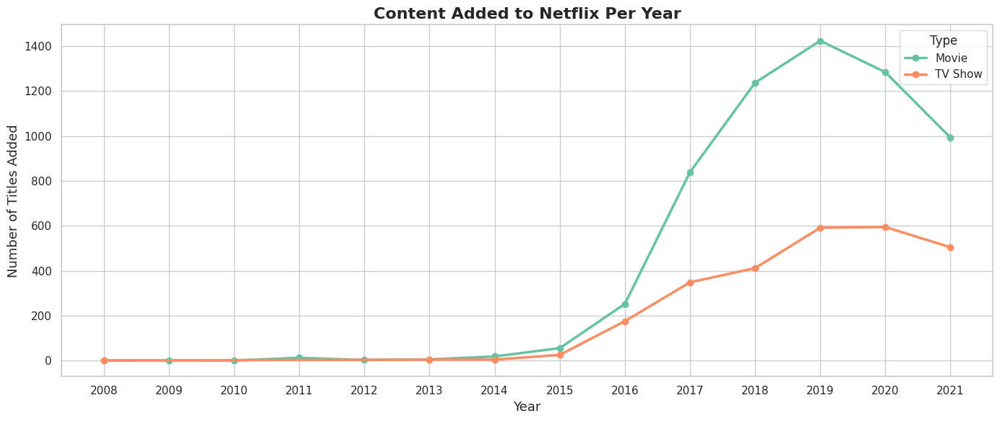
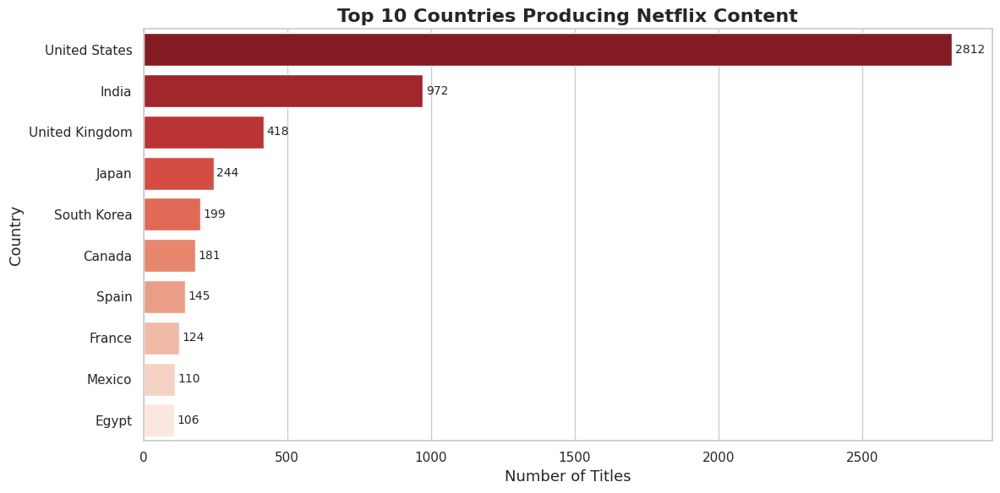
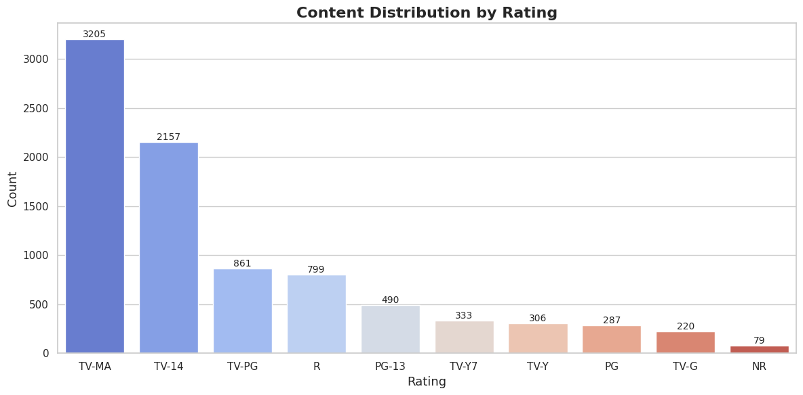
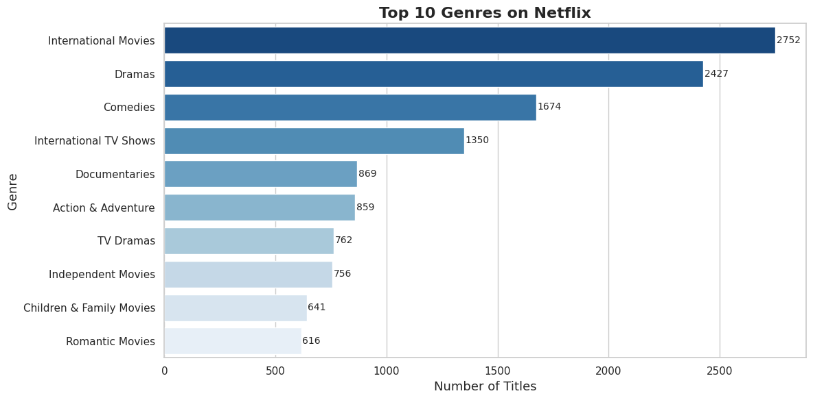
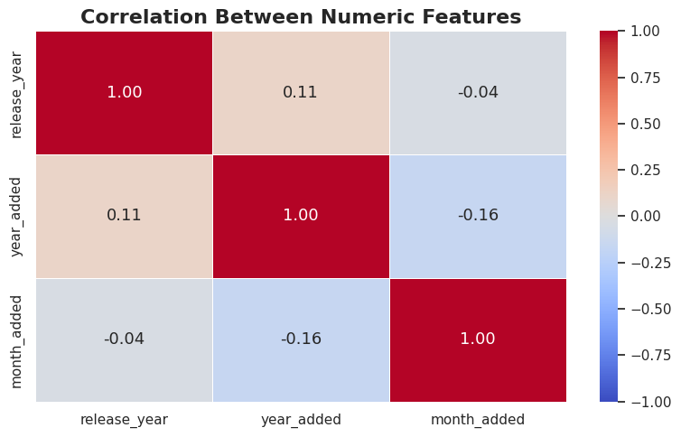

# 🎬 Netflix Content EDA (Exploratory Data Analysis)

> **Synent Technologies Data Science Internship** | Task 3 – Exploratory Data Analysis


---

## 📌 Problem Statement

Netflix is one of the world's largest streaming platforms with thousands of titles across movies and TV shows. The goal of this project is to perform **Exploratory Data Analysis (EDA)** on the Netflix dataset to uncover trends, patterns, and insights about the type of content available, when it was added, which countries produce the most content, and how content is rated and categorized.

---

## 📂 Dataset

| Detail | Info |
|--------|------|
| **Source** | [Kaggle – Netflix Movies and TV Shows](https://www.kaggle.com/datasets/shivamb/netflix-shows) |
| **Records** | 8,807 titles |
| **Columns** | 12 |
| **Features** | Show ID, Type, Title, Director, Cast, Country, Date Added, Release Year, Rating, Duration, Genre, Description |

---

## 🛠️ Tools & Libraries

- **Python 3** – Google Colab
- **Pandas** – Data loading, cleaning and analysis
- **Matplotlib** – Chart rendering
- **Seaborn** – Statistical visualizations

---

## 🔄 Workflow

### 1. Data Cleaning & Preprocessing
- Loaded `netflix_titles.csv` into a Pandas DataFrame
- Filled missing values in `director`, `cast`, `country`, `rating` and `duration`
- Dropped 10 rows with missing `date_added`
- Converted `date_added` to datetime format
- Extracted `year_added` and `month_added` as new columns
- Verified no duplicate rows

### 2. Summary Statistics
- Analyzed content type breakdown (Movies vs TV Shows)
- Explored rating distribution
- Identified release year range
- Found top 10 content-producing countries

---

### 3. Movies vs TV Shows
Visualized the split between Movies and TV Shows on the platform.



---

### 4. Content Added Per Year (Trend Analysis)
Tracked how Netflix grew its content library over the years for both Movies and TV Shows.



---

### 5. Top 10 Countries Producing Content
Identified which countries contribute the most titles to Netflix.



---

### 6. Content Distribution by Rating
Explored how content is rated across the platform.



---

### 7. Top 10 Genres
Analyzed the most popular genres available on Netflix.



---

### 8. Correlation Analysis
Explored relationships between numeric features — release year, year added, and month added.



---

## 📊 Key Insights

- **Movies dominate** Netflix's library, making up around 70% of all content
- **2019 and 2020** saw the highest number of titles added — Netflix was aggressively expanding
- **The United States** is by far the largest content producer on the platform
- **TV-MA and TV-14** are the most common ratings — Netflix targets adult audiences primarily
- **International Movies and Dramas** are the most popular genres on the platform
- **Release year and year added** have a moderate positive correlation — Netflix tends to add recent content

---

## 📁 Repository Structure

```
synent-task3-netflixeda-lindokuhle-moyakhe/
│
├── synent_task3_netflix_eda_lindokuhle.ipynb   # Main notebook
├── netflix_titles.csv                           # Dataset
├── movies_vs_tvshows.png                        # Chart output
├── content_trend_per_year.png                   # Chart output
├── top_countries.png                            # Chart output
├── ratings_distribution.png                     # Chart output
├── top_genres.png                               # Chart output
├── correlation_heatmap_netflix.png              # Chart output
└── README.md                                    # Project documentation
```

---

## 👤 Author

**Lindokuhle Moyakhe**
Data Science Intern | Synent Technologies
📍 Cape Town, South Africa
🔗 [LinkedIn](https://www.linkedin.com/in/lindokuhle-moyakhe-603661253) | [GitHub](https://github.com/kuhle2018)

---

*Part of the Synent Technologies Data Science Internship Program*
